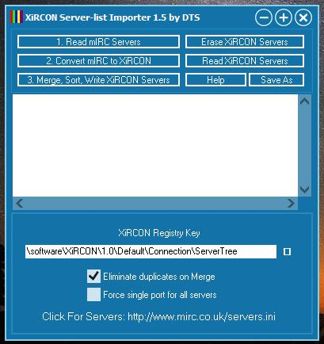

# xircon-server-importer
Imports mIRC IRC chat servers.ini into the old Windows XiRCON IRC chat-client.

Free compiler: [Embarcadero C++ Builder 10.2 Tokyo Starter Edition](https://www.embarcadero.com/products/cbuilder/starter/promotional-download)

